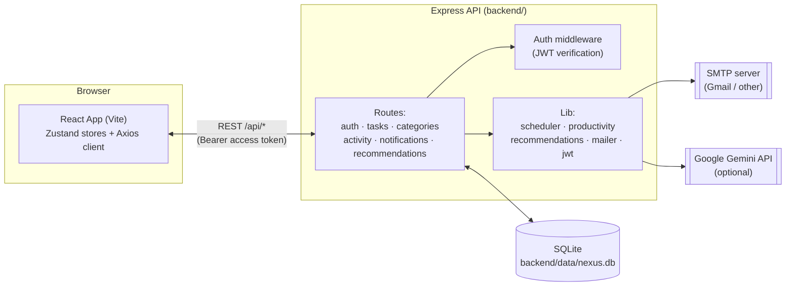
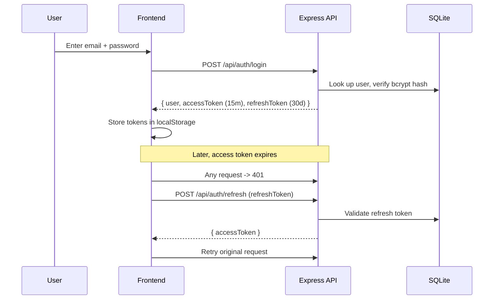
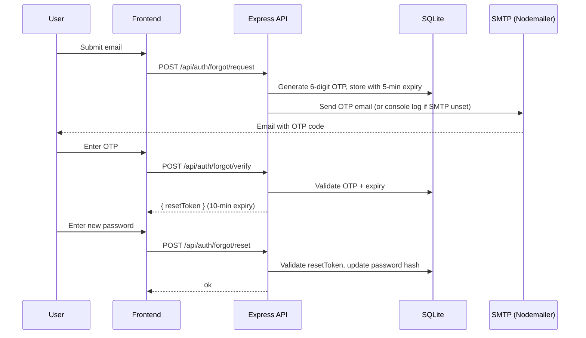
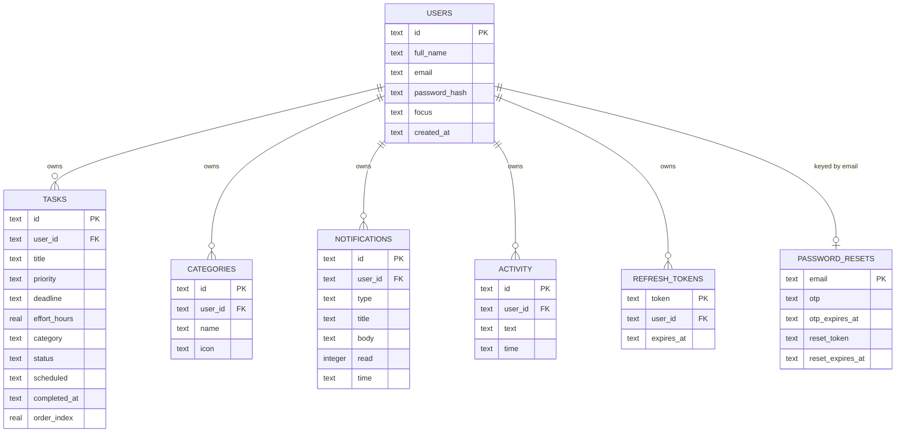

# Nexus Task Manager

Nexus is a full-stack task manager with **auto-scheduling**, **productivity analytics**, and **AI-powered recommendations**. It started as a Claude Design prototype (see [`project/`](./project) and [`chats/`](./chats) for the original design handoff and iteration history) and has since been implemented as a complete React + Express application.

---

## Table of contents

- [Features](#features)
- [Tech stack](#tech-stack)
- [Architecture](#architecture)
- [Authentication & password reset](#authentication--password-reset)
- [Data model](#data-model)
- [Project layout](#project-layout)
- [Getting started](#getting-started)
- [Environment variables](#environment-variables)
- [Deploying to Render](#deploying-to-render)
- [API overview](#api-overview)

---

## Features

- 🔐 **Auth** — signup/login with JWT access + refresh tokens, "forgot password" via emailed OTP
- ✅ **Task management** — create, edit, reorder (drag-and-drop), and complete tasks with priority, deadline, effort estimate, and category
- 🗂️ **Categories** — custom categories with emoji icons, safe deletion with task reassignment
- 📅 **Auto-scheduling** — packs pending tasks into upcoming weekdays (deadline ASC, priority DESC, effort ASC), capped at 8h/day, with overload warnings
- 📊 **Productivity analytics** — completion rate, streaks, workload-by-day breakdown
- 🤖 **AI recommendations** — Gemini-powered suggestions (falls back to built-in heuristics if no API key is configured)
- 🔔 **Notifications & activity feed** — per-user activity log and notification center

---

## Tech stack

| Layer    | Technology |
|----------|------------|
| Frontend | React 18, TypeScript, Vite, Tailwind CSS, Zustand, Axios |
| Backend  | Node.js, Express, TypeScript, better-sqlite3, JWT (jsonwebtoken), bcryptjs |
| Email    | Nodemailer (SMTP) |
| AI       | Google Gemini API (optional) |
| Storage  | SQLite (file-based, `backend/data/nexus.db`) |

---

## Architecture



**Request flow:** the React app calls the Express API under `/api/*`. Every route except `/api/auth/*` and `/api/health` is protected by `requireAuth` middleware, which verifies the JWT access token and attaches `req.userId`. All queries are scoped to `user_id`, so each account only ever sees its own data.

---

## Authentication & password reset

### Login / token refresh



### Forgot password (OTP via email)



> If `SMTP_*` env vars aren't configured, the OTP is logged to the backend console instead of emailed — useful for local development.

---

## Data model



New signups get the default categories (Work, Personal, Academic) and start with no tasks. The seeded `demo@nexus.io` account additionally gets a sample dataset of tasks, activity, and notifications for demo purposes.

---

## Project layout

```
backend/
  src/
    db/            SQLite schema + seed data
    lib/           JWT helpers, mailer, scheduler, productivity, recommendations
    middleware/     requireAuth (JWT verification)
    routes/         auth, tasks, categories, notifications, activity, recommendations
    index.ts        Express app entrypoint
  data/             SQLite database file (generated, gitignored)

frontend/
  src/
    api/            Axios client + per-resource API wrappers
    store/          Zustand stores (auth, tasks, categories, activity, notifications, ui)
    components/     Auth forms, layout (Sidebar/Header), task UI, notifications, shared UI
    views/          Dashboard, Tasks, Schedule, Productivity, Recommendations, Profile
    hooks/          useScheduler, useProductivity
    lib/            Date formatting helpers

chats/      Original Claude Design conversation transcripts (historical reference)
project/    Original HTML prototype + design handoff notes (historical reference)
```

---

## Getting started

### 1. Backend

```bash
cd backend
cp .env.example .env
npm install
npm run dev
```

The API listens on `http://localhost:3001` and stores data in `backend/data/nexus.db` (created automatically on first run).

### 2. Frontend

```bash
cd frontend
npm install
npm run dev
```

The dev server runs on Vite's default port and proxies `/api` to `http://localhost:3001`.

### Demo account

- Email: `demo@nexus.io`
- Password: `Demo!2026`

---

## Environment variables

Configured in `backend/.env` (see `backend/.env.example`):

| Variable | Required | Description |
|----------|----------|-------------|
| `PORT` | No | API port (default `3001`) |
| `JWT_ACCESS_SECRET` | Recommended | Signing secret for short-lived access tokens |
| `JWT_REFRESH_SECRET` | Recommended | Signing secret for refresh tokens |
| `GEMINI_API_KEY` | No | Enables AI-generated recommendations via Gemini |
| `GEMINI_MODEL` | No | Gemini model name (default `gemini-1.5-flash`) |
| `SMTP_HOST` / `SMTP_PORT` / `SMTP_SECURE` | No | SMTP server for sending OTP emails |
| `SMTP_USER` / `SMTP_PASS` | No | SMTP credentials (e.g. Gmail address + app password) |
| `SMTP_FROM` | No | "From" address for OTP emails (defaults to `SMTP_USER`) |
| `CORS_ORIGIN` | No | Comma-separated list of allowed frontend origins. Without it, all origins are allowed |
| `DATA_DIR` | No | Directory for the SQLite database file. Useful for mounting a persistent disk on paid plans |

Without SMTP configured, password-reset OTPs are logged to the backend console instead of emailed. Without `GEMINI_API_KEY`, recommendations fall back to built-in heuristics.

---

## Deploying to Render

This repo includes a [`render.yaml`](./render.yaml) Blueprint that provisions two free-tier services:

- **`nexus-backend`** — Node web service running the Express API
- **`nexus-frontend`** — static site built from `frontend/`, served as static assets

### Steps

1. Push this repo to GitHub (already done if you're reading this on GitHub).
2. In the Render dashboard, click **New +** → **Blueprint**, and select this repository. Render will read `render.yaml` and propose both services.
3. Before deploying, review the env vars:
   - `JWT_ACCESS_SECRET` / `JWT_REFRESH_SECRET` are auto-generated by the blueprint.
   - `CORS_ORIGIN` on the backend and `VITE_API_BASE_URL` on the frontend default to `https://nexus-frontend.onrender.com` / `https://nexus-backend.onrender.com`. If Render assigns different service names/URLs, update these to match the actual URLs after the first deploy, then redeploy.
   - Optionally set `GEMINI_API_KEY`, `GEMINI_MODEL`, and the `SMTP_*` vars (for AI recommendations and OTP emails) — these are left blank in the blueprint (`sync: false`) so you can fill them in securely from the dashboard.
4. Click **Apply** to create and deploy both services.

### Notes

- **The free plan has an ephemeral filesystem** — Render's free web services don't support attached disks, so the SQLite database is wiped on every redeploy (and the demo/seed data regenerates). This is fine for demos and testing; for persistent data, upgrade `nexus-backend` to a paid instance type, add a `disk` block to `render.yaml` (mount path e.g. `/data`), and set `DATA_DIR=/data`.
- Free web services also **spin down after inactivity** and take ~30-60s to wake on the next request.
- Because `VITE_API_BASE_URL` is baked into the frontend at **build time**, any change to it requires a rebuild/redeploy of `nexus-frontend`.
- The frontend is a single-page app with no client-side routing, so no rewrite rules are needed for the static site.

---

## API overview

All endpoints are prefixed with `/api`. Routes other than `/auth/*` and `/health` require `Authorization: Bearer <accessToken>`.

| Route | Description |
|-------|-------------|
| `POST /auth/signup` | Create account |
| `POST /auth/login` | Log in |
| `POST /auth/refresh` | Exchange refresh token for new access token |
| `POST /auth/logout` | Invalidate refresh token |
| `GET /auth/me` / `PATCH /auth/me` | Get/update current user |
| `POST /auth/forgot/request` | Request password reset OTP (emailed) |
| `POST /auth/forgot/verify` | Verify OTP, get reset token |
| `POST /auth/forgot/reset` | Reset password with reset token |
| `GET /tasks` / `POST /tasks` | List / create tasks |
| `PATCH /tasks/:id` / `DELETE /tasks/:id` | Update / delete a task |
| `POST /tasks/reorder` | Persist drag-and-drop order |
| `POST /tasks/auto-schedule` | Auto-schedule pending tasks |
| `POST /tasks/clear-schedule` | Clear auto-schedule |
| `GET /categories` / `POST /categories` / `DELETE /categories/:name` | Manage categories |
| `GET /activity` / `POST /activity` | Activity feed |
| `GET /notifications` | List notifications |
| `PATCH /notifications/read-all` | Mark all as read |
| `DELETE /notifications/:id` / `DELETE /notifications` | Delete one / all |
| `GET /recommendations/status` | Whether Gemini is configured |
| `POST /recommendations/generate` | Get AI or heuristic recommendations |
| `GET /health` | Health check |
